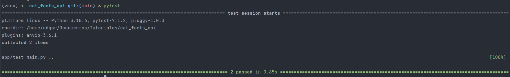

# Cat facts API
### Project to interact with Daily Cat facts! via API REST with fastapi ###
Gets a number of [facts](https://alexwohlbruck.github.io/cat-facts/docs/) that were updated in the current year.

## Run Project
1. Use `Make`:
```
make build # Build the image
make start # Start the container
make stop # Stop the container
```
2. Access to `http://localhost/health-check` to check if is up. The response should be displayed:
```
{
    "status": "Running..."
}
```
## Usage
### Get facts ###
- **URL:** `cat-facts/{NUMBER}`
- **Method:** `GET`
- **Code:** `200`
- **Response:**
```
[
    {
        "status": {
            "verified": null,
            "sentCount": 0
        },
        "_id": "61d3128c403b4002d378eaeb",
        "user": "61c46a7495ba44272eb975e2",
        "text": "The newest fact about cats.",
        "type": "cat",
        "deleted": false,
        "createdAt": "2022-01-03T15:13:16.302Z",
        "updatedAt": "2022-01-03T15:13:16.302Z",
        "__v": 0
    }
]
```
**500 is the maximum value. You can validate the response size with the page `https://codebeautify.org/jsonviewer`**

## Test
Run `pytest`


## Swagger##
#### Swagger docs
**url**: `docs/`